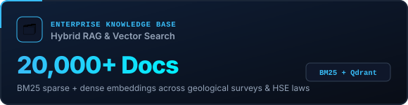
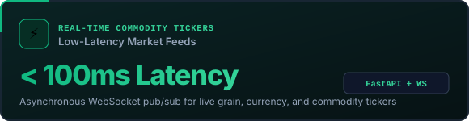
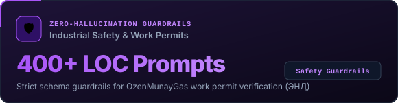
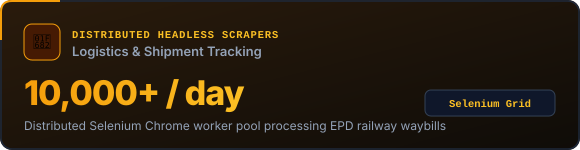
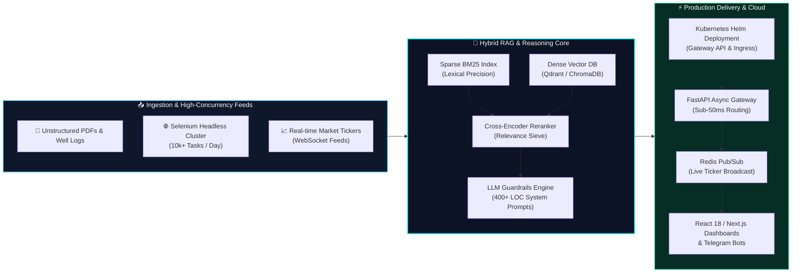

<p align="center">
  
</p>

<p align="center">
  <a href="https://linkedin.com"></a>
  <a href="https://t.me"></a>
  <a href="mailto:meiram@example.com"></a>
  <a href="https://github.com/disamee"></a>
</p>

---

### ⚡ Executive Summary

I architect and deliver **production-grade Artificial Intelligence, Hybrid RAG Systems, High-Concurrency Web Scraping Farms, and Real-Time Financial/Commodity Platforms**. 

Over the past several years, I have engineered mission-critical systems for leading industrial and financial enterprises (including **KazMunayGas / OzenMunayGas**, commodity trade groups, and financial analytics platforms). My focus is end-to-end architectural rigor: from document parsing and hybrid vector retrieval down to sub-100ms async backends, Kubernetes cluster deployments, and reactive web interfaces.

---

### 📊 Production Impact & Engineering Metrics

<table>
  <tr>
    <td width="50%">
      
    </td>
    <td width="50%">
      
    </td>
  </tr>
  <tr>
    <td width="50%">
      
    </td>
    <td width="50%">
      
    </td>
  </tr>
</table>

---

### 🏗️ Enterprise System Architecture Blueprint

Below is the high-throughput, low-latency architecture pattern utilized across my industrial RAG and real-time streaming deployments:



---

### 🏛️ Featured Enterprise Architecture Case Studies

> *(Due to corporate confidentiality and NDA compliance, proprietary codebases and internal corporate data are protected. The repositories below contain comprehensive technical architecture whitepapers, Mermaid topology diagrams, benchmark evaluations, and deployment manifests.)*

<table>
  <tr>
    <td width="50%" valign="top">
      <h4>🌾 <a href="https://github.com/disamee/fergus-commodity-analytics-case-study">Fergus Commodity Analytics</a></h4>
      <p><b>Domain:</b> FinTech &amp; Commodity Trading RAG</p>
      <p>Hybrid RAG engine for grain traders with real-time price prediction, automated SharePoint knowledge base synchronization, and currency trend charts.</p>
      <p>
        
        
        
        
      </p>
      <p><a href="https://github.com/disamee/fergus-commodity-analytics-case-study"><b>→ Read Architecture Whitepaper</b></a></p>
    </td>
    <td width="50%" valign="top">
      <h4>🛢️ <a href="https://github.com/disamee/geological-rag-architecture-case-study">Geological Subsurface RAG</a></h4>
      <p><b>Domain:</b> Energy &amp; Oil &amp; Gas AI</p>
      <p>Multimodal PDF/well log chunking pipeline, sparse BM25 + dense vector search, and K8s infrastructure sizing for massive geological survey archives.</p>
      <p>
        
        
        
        
      </p>
      <p><a href="https://github.com/disamee/geological-rag-architecture-case-study"><b>→ Read Architecture Whitepaper</b></a></p>
    </td>
  </tr>

  <tr>
    <td width="50%" valign="top">
      <h4>🛡️ <a href="https://github.com/disamee/industrial-hse-rag-case-study">OzenMunayGas HSE Assistant</a></h4>
      <p><b>Domain:</b> Industrial Safety Compliance (KMG)</p>
      <p>Zero-hallucination work permit safety assistant with 400+ LOC prompt guardrails, zero-CORS iframe embed, and automated legal compliance verification.</p>
      <p>
        
        
        
        
      </p>
      <p><a href="https://github.com/disamee/industrial-hse-rag-case-study"><b>→ Read Architecture Whitepaper</b></a></p>
    </td>
    <td width="50%" valign="top">
      <h4>🚂 <a href="https://github.com/disamee/epd-shipment-tracking-case-study">EPD Railway Shipment Tracker</a></h4>
      <p><b>Domain:</b> High-Concurrency Logistics Automation</p>
      <p>Distributed headless Selenium Chrome worker pool, async queue processing, automated Excel generation, and Telegram notification bots.</p>
      <p>
        
        
        
        
      </p>
      <p><a href="https://github.com/disamee/epd-shipment-tracking-case-study"><b>→ Read Architecture Whitepaper</b></a></p>
    </td>
  </tr>

  <tr>
    <td width="50%" valign="top">
      <h4>📈 <a href="https://github.com/disamee/agri-economic-dashboard-case-study">AgriDash Real-Time Dashboard</a></h4>
      <p><b>Domain:</b> Full-Stack Financial Data Platform</p>
      <p>FastAPI backend with React 18 frontend, streaming live commodity prices, FX exchange rates, and interactive correlation heatmaps via WebSockets.</p>
      <p>
        
        
        
        
      </p>
      <p><a href="https://github.com/disamee/agri-economic-dashboard-case-study"><b>→ Read Architecture Whitepaper</b></a></p>
    </td>
    <td width="50%" valign="top">
      <h4>💰 <a href="https://github.com/disamee/microfinance-aggregator-case-study">Microfinance Aggregator Engine</a></h4>
      <p><b>Domain:</b> FinTech &amp; Regulatory Compliance</p>
      <p>Microfinance comparison engine integrated with ARDFM regulatory standards, loan rate history tracking, and multi-lingual i18n localization.</p>
      <p>
        
        
        
        
      </p>
      <p><a href="https://github.com/disamee/microfinance-aggregator-case-study"><b>→ Read Architecture Whitepaper</b></a></p>
    </td>
  </tr>
</table>

---

### 🛠️ Production Tech Stack Matrix

```
┌──────────────────────────────┬──────────────────────────────────────────────────────────────┐
│ DOMAIN                       │ TECHNOLOGIES & TOOLS                                         │
├──────────────────────────────┼──────────────────────────────────────────────────────────────┤
│ 🧠 AI / RAG / Data           │ LangChain · LlamaIndex · PyTorch · BM25 · ChromaDB · Qdrant  │
│                              │ Embeddings · Cross-Encoder Rerankers · Strict Guardrails     │
├──────────────────────────────┼──────────────────────────────────────────────────────────────┤
│ ⚡ Systems & Backend          │ Python 3.11+ · FastAPI · Celery · Redis · PostgreSQL · SQL   │
│                              │ SQLAlchemy · AsyncIO · WebSockets · Distributed Task Queues  │
├──────────────────────────────┼──────────────────────────────────────────────────────────────┤
│ 💻 Frontend & Visualization  │ TypeScript · JavaScript · React 18 · Next.js · Vite · Recharts│
│                              │ Tailwind CSS · Radix UI · WebSocket Clients · i18n           │
├──────────────────────────────┼──────────────────────────────────────────────────────────────┤
│ 🛡️ Cloud, DevOps & Scraping  │ Kubernetes · Helm · Docker · Docker Compose · Gateway API    │
│                              │ GitHub Actions CI/CD · Selenium Headless · Linux / Bash      │
└──────────────────────────────┴──────────────────────────────────────────────────────────────┘
```

---

### 🎯 Fast-Track for Recruiters & Engineering Leadership

* **Immediate Value Add**: Full-cycle architectural ownership — capable of taking an ambiguous problem statement from research/POC to resilient, production-hardened K8s deployment in weeks.
* **Domain Fluency**: Proven execution in high-stakes domains (Energy/Oil &amp; Gas, FinTech, Commodity Trading, Regulatory Compliance).
* **Work Arrangement**: Open to **Staff / Senior AI Engineer, Systems Architect, or Lead Full-Stack Roles** (Remote Global / Hybrid / Relocation).
* **Languages**: English (Professional / Technical), Russian (Native).

<p align="center">
  <a href="https://linkedin.com"><b>Connect on LinkedIn</b></a> • 
  <a href="https://t.me"><b>Message on Telegram</b></a> • 
  <a href="mailto:meiram@example.com"><b>Send Email</b></a>
</p>
